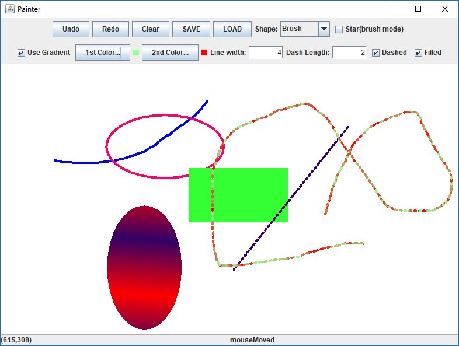

# Painter
This is the final project of Java Programming in 2014 June at NCTU. 

## Introduction
A basic painter program which can draw several shapes in different style. Provide undo, redo, save and load image functions also.

## Demo

